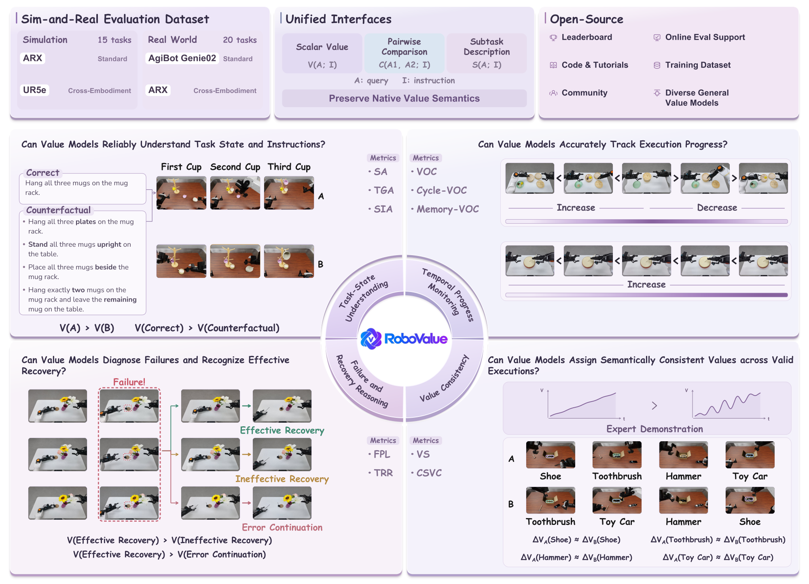
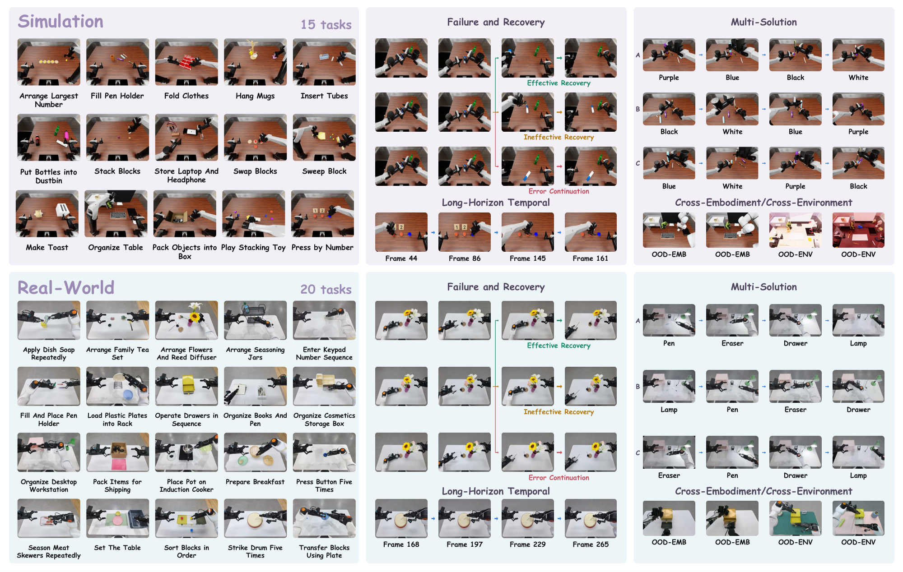

<div align="center">
  
</div>

<div align="center">
  <!-- Add official arXiv and Hugging Face URLs once released. -->
  
  
  <a href="https://robovalue-benchmark.github.io/doc/"></a>
  <!-- Add the Chinese documentation URL when available. -->
  
  <a href="https://robovalue-benchmark.github.io/"></a>
  <a href="https://robovalue-benchmark.github.io/leaderboard/"></a>
  <a href="https://robovalue-benchmark.github.io/community/"></a>
</div>

<div align="center">

[](README.md) [](README.zh-CN.md)

</div>

<h1 align="center">
  <sub>RoboValue: A Fine-Grained Sim-and-Real Benchmark<br />for Unified Evaluation of Robotic Value Models</sub>
</h1>

**RoboValue** is an evaluation benchmark for robotic value models across simulation and the real-world, using fine-grained diagnostic trajectories to assess task outcomes and execution processes.

<div align="center">
  
</div>

## 🏆 Leaderboard

View full rankings and model configurations on the [**RoboValue Leaderboard**](https://robovalue-benchmark.github.io/leaderboard/), with separate Zero-Shot and One-Shot tracks.

## 📰 What's New <a name="whats-new"></a>

- [2026/10] 🔥 Our paper **RoboValue: A Fine-Grained Sim-and-Real Benchmark for Unified Evaluation of Robotic Value Models** is officially released.

## ✨ Highlights

- 🎯 **Fine-grained value evaluation.** Assess task-state understanding, temporal progress monitoring, failure and recovery reasoning, and value consistency through a shared evaluation protocol.

- 🤖 **Diverse sim-and-real manipulation tasks.** RoboValue covers **15 simulation tasks** adapted from [RoboDojo](https://github.com/RoboDojo-Benchmark/RoboDojo/blob/main/README.md) and **20 real-world dual-arm manipulation tasks**.

- 🔍 **Diagnostic execution scenarios.** Counterfactual instructions, recurring visual states, effective and ineffective recoveries, and alternative valid subtask orders expose errors that outcome accuracy and forward-progress correlation can overlook.

- 🌍 **Controlled generalization tests.** Evaluate in-domain and under separate **cross-embodiment** and **cross-environment** shifts, without additional adaptation to the shifted conditions.

<div align="center">
  
</div>

<details>
<summary><strong>Capability and metric reference</strong></summary>

| Capability | Metric | What it evaluates |
| --- | --- | --- |
| **Task-State Understanding** | **SA ↑** — Success Accuracy | Whether successful episodes receive higher terminal values than unsuccessful ones |
| | **TGA-CT / TGA-CF ↑** — Task Grounding Accuracy | Whether the correct instruction yields a larger value gain than cross-task (CT) or counterfactual (CF) instructions for the same execution |
| | **SIA ↑** — Subtask Identification Accuracy | Identification of the active subtask from generated descriptions, scored by a separate LLM judge |
| **Temporal Progress Monitoring** | **VOC ↑** — Value-Order Correlation | Rank correlation between predicted values and temporal progress along successful trajectories |
| | **Cycle-VOC ↑** | Progress and regression during continuous forward–reverse playback, with preceding history retained |
| | **Memory-VOC ↑** | Progress ordering in long-horizon trajectories where similar visual states recur under different execution histories |
| **Failure and Recovery Reasoning** | **FPL ↓** — Failure-Point Localization | Normalized timing error between the onset inferred from the largest detected value decline and the annotated failure onset |
| | **TRR ↑** — Trajectory Recovery Reasoning | Required value trends during initial failure, continued error, recovery attempts, and their successful or failed outcomes |
| **Value Consistency** | **VS ↑** — Value Stability | Stable, informative feedback that avoids unnecessary fluctuations and prolonged flat regions |
| | **CSVC ↑** — Cross-Solution Value Consistency | Comparable local value gains for the same semantic subtask across different valid solutions |

**↑ Higher is better; ↓ lower is better.**

</details>

### Evaluation Status

| Setting | Task-specific data | Status |
| --- | --- | --- |
| **Zero-Shot** | None | ✅ Results available |
| **One-Shot** | 1 training demonstration per task | ✅ Results available |
| **Full-Shot** | Complete training split | 📋 Planned |

## 🧩 Supported Value Models

**✅** marks metrics available through the current adapters and runner policy in `base` mode, subject to task coverage and required model assets; **—** means unavailable. Model names link to setup guides; [validation evidence](docs/testing.md) records the tested scope.

**TGA** includes TGA-CT and TGA-CF; **VOC family** includes VOC, Cycle-VOC, and Memory-VOC. CSVC currently supports ID evaluation only.

| Model family | SA / TGA | SIA | VOC family | FPL / TRR | VS / CSVC | Config |
| --- | :---: | :---: | :---: | :---: | :---: | --- |
| [**RoboMeter**](docs/baselines/robometer.md) | ✅ | — | ✅ | ✅ | ✅ | [YAML](configs/robometerconfigs.yaml) |
| [**Robo-Dopamine**](docs/baselines/robodopamine.md) | ✅ | — | ✅ | ✅ | ✅ | [YAML](configs/robodopamineconfigs.yaml) |
| [**ProcVLM**](docs/baselines/procvlm.md)<sup>1</sup> | ✅ | ✅ | ✅ | ✅ | ✅ | [YAML](configs/procvlmconfigs.yaml) |
| [**RoboReward**](docs/baselines/roboreward.md)<sup>2</sup> | ✅ | — | — | ✅ | ✅<sup>2</sup> | [YAML](configs/roborewardconfigs.yaml) |
| [**VLAC**](docs/baselines/vlac.md) | ✅ | — | ✅ | ✅ | ✅ | [YAML](configs/vlacconfigs.yaml) |
| [**TOPReward (Qwen / Molmo)**](docs/baselines/topreward.md) | ✅ | — | ✅ | ✅ | ✅ | [YAML](configs/toprewardconfigs.yaml) |
| [**RoboFAC**](docs/baselines/robofac.md) | ✅ | ✅ | ✅ | ✅ | ✅ | [YAML](configs/robofacconfigs.yaml) |
| [**RynnValue**](docs/baselines/rynnvalue.md) | ✅ | — | ✅ | ✅ | ✅ | [YAML](configs/rynnvalueconfigs.yaml) |
| [**LIV**](docs/baselines/liv.md) | ✅ | — | ✅ | ✅ | ✅ | [YAML](configs/livconfigs.yaml) |
| [**FailSafe-labeled integration**](docs/baselines/failsafe.md)<sup>3</sup> | — | ✅ | — | — | — | [YAML](configs/failsafeconfigs.yaml) |

<sup>1</sup> ProcVLM one-shot requires task-specific LoRA checkpoints and excludes `press_by_number` and `swap_blocks` from VOC and Memory-VOC.

<sup>2</sup> RoboReward's current runner disables the VOC family. VS and CSVC remain implemented but were not evaluated for RoboReward in the paper; this row describes code support, not published result coverage.

<sup>3</sup> The SIA-only FailSafe integration requires the original local assets; equivalence to the official implementation remains unverified.

## 🚀 Quick Start <a name="quick-start"></a>

To evaluate your model, provide its **inference service and a model-specific Adapter**. The Adapter wraps your model's existing predictions; the **RoboValue team handles query planning, metric computation, aggregation, and reporting** on the private test set. Follow the [model integration guide](docs/api.md).

**1. Prepare your model service.**

Keep your model running in its own environment. Document its inference endpoint, native request/response format, and fixed model and preprocessing versions. Prepare any training references on the model side before evaluation, according to the agreed setting.

**2. Implement and check your Adapter.**

```bash
GIT_LFS_SKIP_SMUDGE=1 git clone https://github.com/RoboValue-Benchmark/RoboValue.git
cd RoboValue
```

Start from the [Adapter interface](src/vmbmk/adapters/base.py) and [CPU mock Adapter](src/vmbmk/adapters/mock_service.py). Adapt input preparation, service calls, and output mapping to your model. Implement only the operations it supports, returning one prediction per query in the original order:

| Method | Returns |
| --- | --- |
| `value` | A scalar assessment from your model |
| `compare` | A score comparing ordered contexts A and B |
| `subtask` | A description of the current subtask |

Preserve the model's native camera/history requirements and output semantics. RoboValue computes benchmark metrics from these predictions.

To try the public CPU mock example, use **Python 3.10+ with PyYAML and Pillow** and run:

```bash
PYTHONPATH=src:tests python -m unittest discover -s tests/adapters -p test_mock_service.py -v
```

This checks the example Adapter with synthetic images; it needs no GPU, model checkpoint, running API, or private test data. The [example configuration](configs/mock_service.example.yaml) illustrates the handoff format with placeholder paths.

**3. Arrange evaluation.**

[Contact the RoboValue team](#contact) with your Adapter, example configuration, service specification, model/preprocessing versions, and a runnable synthetic example. Share any service credentials separately. The team reviews the integration and runs compatible metrics on the private test set.

<details>
<summary><strong>More documentation</strong></summary>

| Guide | Contents |
| --- | --- |
| [Baseline setup](docs/baselines/README.md) | Installation prerequisites and model-specific instructions |
| [Data preparation](docs/data.md) | Dataset structure, metadata, annotations, and asset paths |
| [Configuration and commands](docs/configuration.md) | YAML fields, evaluation modes, and CLI usage |
| [Model services and adapters](docs/api.md) | Provider handoff, native interfaces, references, and the CPU mock example |
| [Environment details](docs/environments.md) | Lockfiles, custom roots, and native builds |
| [Metric implementation notes](docs/metric_alignment.md) | Scoring alignment and protocol changes |
| [Result interfaces](docs/result_publication.md) | Validation, publication, and SIA intermediate outputs |
| [Developer guide](docs/developer_guide.md) | Package layout, call flow, and extension points |
| [Testing and evidence](docs/testing.md) | CPU tests, bounded model checks, and known limitations |

</details>

## 🗂️ Repository Structure

```text
RoboValue/
├── configs/              # Per-model evaluation templates
├── envs/                 # Isolated runtimes, dependency locks, and setup scripts
├── src/vmbmk/
│   ├── adapters/         # Model integrations and shared interfaces
│   ├── metrics/          # Query planning and metric scoring
│   ├── data/             # Dataset validation and trajectory playback
│   ├── inference/        # Typed queries and model workers
│   ├── runner/           # Evaluation, batching, and resume
│   ├── tools/            # Data checks, result handling, and visualization
│   └── cli.py            # Command-line entry points
├── docs/                 # Setup guides and protocol documentation
├── tests/                # Metric, adapter, and data tests
└── vmbmk.sh              # Evaluation launcher
```

Datasets, downloaded model assets, environments, and generated outputs are configured separately; see [data preparation](docs/data.md) and [baseline setup](docs/baselines/README.md#source-runtime-and-checkpoint-roots) for storage conventions. LIV's distributed assets use Git LFS.

## 📝 Citation <a name="citation"></a>

If you find **RoboValue** helpful in your research, please cite our paper. The BibTeX entry will be added here.

## 📬 Contact <a name="contact"></a>

For model evaluation and research enquiries, please contact:

- **Shengbang Liu**: [liushengbang0209@gmail.com](mailto:liushengbang0209@gmail.com)
- **Zhengye Du**: [duzhengye20060120@gmail.com](mailto:duzhengye20060120@gmail.com)
- **Zhilong Wan**: [zhilongwan666@gmail.com](mailto:zhilongwan666@gmail.com)
- **Chenxiang Xia**: [chenxiangxia48@gmail.com](mailto:chenxiangxia48@gmail.com)
- **Chang Ge**: [gechang0706@gmail.com](mailto:gechang0706@gmail.com)
- **Jinyang Xiao**: [xiaojy36@gmail.com](mailto:xiaojy36@gmail.com)
- **Nan Wang**: [bigcileng@gmail.com](mailto:bigcileng@gmail.com)
- **Chao Yu**: [zoeyuchao@gmail.com](mailto:zoeyuchao@gmail.com)
